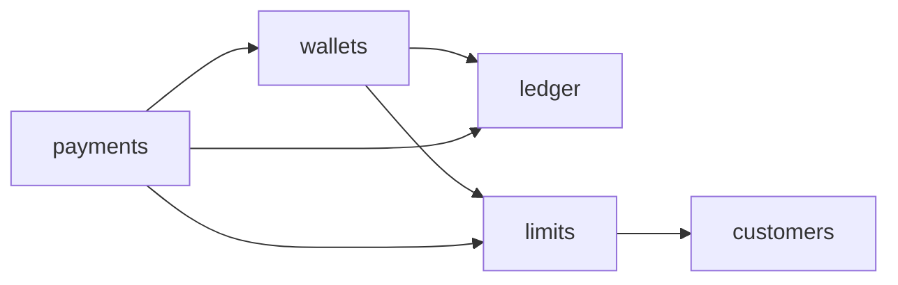

# ADR 0001: Project Structure

- Status: Accepted
- Date: 2026-09-26

## Context

bansacta is a fintech application covering wallets, internal transfers, and external payments through a provider, with transaction limits keyed by KYC tier. It is built as a single deployable Go application backed by one PostgreSQL database.

The structure must keep financial invariants isolated and testable, make module ownership explicit, and allow a module to be extracted later without untangling the whole codebase.

## Decision

Build a modular monolith with feature-first packages under `internal/`, using stdlib `net/http`, sqlc, and PostgreSQL.

### Layout

```text
cmd/
  api/                 HTTP process entry point
  worker/              background jobs entry point
internal/
  money/               shared monetary value type
  identity/            authentication: users, credentials, sessions, roles
  customers/           KYC profile, verification status, tier
  wallets/             financial accounts, balances, transfers
  ledger/              double-entry journal, internal only
    domain/            pure invariants, isolated from infrastructure
  payments/            payment intents, provider integration
  limits/              transaction limit policy and usage, keyed by tier
  platform/            technical capabilities only, never business logic
    config/
    database/          connection pool and the shared transaction type
    httpx/
migrations/            single ordered sequence, module-prefixed filenames
api/openapi/           spec of record
tests/integration/     cross-module flows only
deployments/
docs/adr/
```

### Module responsibilities

- `identity`: authentication only. The word "account" is not used here, so login accounts are never confused with financial accounts. Identity does not depend on `customers`; login must work before KYC completes and must survive a `customers` outage.
- `customers`: KYC profile and tier. Stores the user ID as a plain reference and does not call `identity`.
- `wallets`: financial accounts and transfers. Owns the mapping from a wallet to its ledger accounts and is the only module that posts wallet movements to the ledger.
- `ledger`: append-only double-entry journal. Has no HTTP layer; it is called only through Go interfaces, inside the caller's transaction.
- `payments`: payment intents and provider integration. Credits and debits wallets through `wallets`. Posts to the ledger directly only for its own accounts (provider settlement, fees).
- `limits`: per-transaction caps and daily and monthly totals by customer tier. Consulted by both `wallets` and `payments`. API rate limiting is a transport concern and belongs in `platform/httpx`.
- `platform`: technical capabilities only. Starts with `config`, `database`, and `httpx`; further subpackages are added with the first feature that needs them. Logging uses stdlib `slog` until a wrapper is justified.

### Module dependencies



- An arrow means "calls through an interface declared in the caller."
- No module reads another module's tables. Each module owns its own database schema.
- Interfaces live in the consuming package. There is no shared `ports` package.
- `identity` and `customers` have no dependency on each other.
- `payments --> ledger` is restricted to payments-owned ledger accounts; wallet movements always go through `wallets`.

### Transactions

The transaction type shared across modules is defined in `platform/database`. Any module operation that must commit atomically with its caller takes this type as a parameter rather than opening its own transaction.

### File convention

When implementation begins, each module uses:

- `setup.go`: construction and route registration
- one file per domain type
- `service.go`: use cases
- `store.go`: persistence
- `http.go`: transport

Files stay flat. A `domain/` subpackage is promoted when a module's rules become the thing most feared to break. A package is split when it passes roughly fifteen files.

### Tests

- `_test.go` files sit beside the code they test.
- Fakes are declared in the test file that uses them; there is no `mocks/` package.
- Database tests skip under `go test -short`.
- `tests/integration/` is reserved for flows that cross module boundaries.

### Migrations

One shared ordered sequence in `migrations/` avoids cross-module ordering problems. Filenames carry the owning module, for example `0003_ledger_create_postings.sql`.

## Consequences

- One deployment and one database keep operations simple, and cross-module work can commit atomically.
- Module boundaries are conventions within one Go module, so they must be enforced by review and lint rules rather than by the compiler.
- A module can be extracted later because it already owns its schema and is reached only through interfaces.

## Decisions pending

Each gets its own ADR when the feature is implemented:

- Ledger integrity: append-only postings enforced by database grants, balanced journals, idempotent postings.
- Limits concurrency: limit check and debit in one transaction with the usage row locked.
- Money representation: integer minor units plus currency, no floats. Must be decided before the first table stores an amount.
